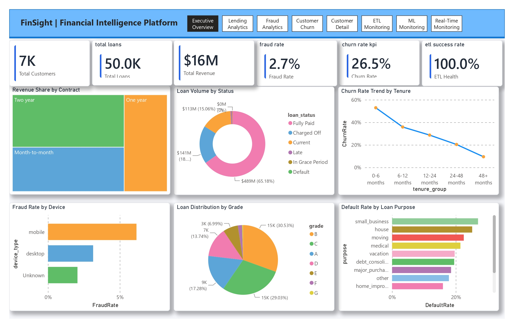

# FinSight: Banking Analytics Platform

End-to-end financial analytics and ML platform covering data engineering, model training, real-time inference, prediction monitoring, and dashboards.

**Stack:** Airflow, PostgreSQL, Power BI, XGBoost, LightGBM, CatBoost, FastAPI, MLflow, Docker, Streamlit, Redis Streams

## How it works

Raw CSVs go through an Airflow ETL pipeline into PostgreSQL. From there, a feature store is computed and ML models are trained. The trained models are served through a FastAPI endpoint, which Streamlit calls for interactive predictions. Power BI reads from PostgreSQL directly for dashboards.

```
CSV Datasets (3 sources, ~2.8M rows total)
  |
Apache Airflow (daily at 2am, parallel ETL tasks)
  |
PostgreSQL 16 (fact_churn, fact_loan, fact_transaction)
  |
Feature Store (composite risk score: 0.4 x fraud + 0.3 x default + 0.3 x churn)
  |
ML Training (3-4 candidates per task, F1 threshold tuning, ROC-AUC selection)
  |
MLflow (experiment tracking, model registry, artifact store)
  |
FastAPI (HMAC auth, Redis rate limiter, prediction monitoring)
  |
Power BI (8 pages, 50+ DAX measures, TMDL semantic model)
Streamlit (ML workbench, 4 tabs)

Redis Streams -> Producer -> Consumer -> fact_streaming_transaction -> Power BI Real-Time page
```

## Quick Start

```bash
# One command (PowerShell)
.\scripts\bootstrap.ps1

# Or manually:
docker compose -f docker/docker-compose.yml -f docker/docker-compose.local.yml up -d

python etl/scripts/run_local_etl.py --source churn
python etl/scripts/run_local_etl.py --source lending --sample 50000
python etl/scripts/run_local_etl.py --source fraud   --sample 50000
python etl/scripts/feature_store.py

python -m models.train_all --task all --max-rows 150000 --log-mlflow
python etl/scripts/load_model_training.py

# Open FinSight/FinSight.pbip in Power BI Desktop
```

See [docs/setup_runbook.md](docs/setup_runbook.md) for detailed setup and troubleshooting.

## Module Documentation

| Module | README | Covers |
|---|---|---|
| Data Engineering | [etl/README.md](etl/README.md) | Airflow DAG, Pandas/PySpark ETL, feature store |
| Data Warehouse | [sql/README.md](sql/README.md) | Star schema, ER diagram, table definitions |
| Machine Learning | [models/README.md](models/README.md) | Training pipeline, MLflow, SMOTE, threshold tuning |
| API | [api/README.md](api/README.md) | FastAPI endpoints, auth, rate limiting, monitoring |
| Streaming | [streaming/README.md](streaming/README.md) | Redis Streams producer/consumer |
| Power BI | [FinSight/README.md](FinSight/README.md) | Semantic model, DAX measures, dashboard pages |
| Streamlit | [streamlit/README.md](streamlit/README.md) | ML workbench, prediction demos |
| Infrastructure | [docker/README.md](docker/README.md) | Docker Compose services and ports |

## Data Sources

| Dataset | Records | Source | Used For |
|---------|---------|--------|----------|
| IBM Telco Churn | 7,043 | IBM | Customer churn prediction |
| Lending Club | 2.2M, sampled to 50K | Kaggle | Loan default prediction |
| IEEE-CIS Fraud | 590K, sampled to 50K | Kaggle/IEEE | Fraud detection |

## ML Models

| Task | Algorithm | ROC-AUC | Decision Threshold |
|------|-----------|---------|-------------------|
| Customer Churn | LightGBM | 0.8368 | 0.32 |
| Loan Default | CatBoost | 0.6616 | 0.32 |
| Fraud Detection | LightGBM | 0.7565 | 0.74 |

Per task, 3-4 candidate algorithms are trained and the one with the highest ROC-AUC wins. The decision threshold is tuned separately via an F1 grid search from 0.1 to 0.9.

## API Endpoints

| Method | Endpoint | Auth | Description |
|--------|----------|------|-------------|
| GET/POST | `/health` | No | Health check |
| POST | `/predict/churn` | Yes | Churn prediction |
| POST | `/predict/default` | Yes | Loan default prediction |
| POST | `/predict/fraud` | Yes | Fraud detection |
| POST | `/metrics` | No | Model health per task |
| GET | `/powerbi/prediction-monitoring` | No | Live stats for Power BI |

Middleware: HMAC auth on `/predict/*`, Redis sliding-window rate limiter (100 req/min), prediction logging to PostgreSQL, GZip compression.

## Power BI Dashboard



| Page | What it shows |
|------|--------------|
| Executive Overview | Total customers, churn rate, default rate, fraud rate, revenue |
| Lending Analytics | Default by grade, loan volume, risk exposure |
| Fraud Analytics | Fraud by device and card type, transaction volume, loss percentage |
| Customer Churn | Churn by contract type, revenue at risk, retention rate |
| Customer Detail | Individual customer drillthrough with full risk profile |
| ETL Monitoring | Pipeline run history, success rate, records processed |
| ML Monitoring | Predictions per model, average confidence, latency, fallback rate |
| Real-Time Monitoring | Live transaction volume, rolling fraud rate, recent alerts |

Semantic model: 13 tables (6 fact, 2 dimension, 2 ML monitoring, 3 streaming), connected via PostgreSQL in Import mode.

## Feature Store

Computed daily from all three fact tables and written to the `feature_store` table.

| Feature | Source | Current Value |
|---------|--------|---------------|
| Churn Rate | fact_churn | 26.54% |
| Default Rate | fact_loan | 18.06% |
| Fraud Rate | fact_transaction | 2.71% |
| Composite Risk Score | Weighted | 0.1446 |

Formula: `composite_risk_score = 0.40 * fraud_rate + 0.30 * default_rate + 0.30 * churn_rate`

## Services

```bash
docker compose -f docker/docker-compose.yml -f docker/docker-compose.local.yml up -d
```

| Service | URL |
|---------|-----|
| PostgreSQL | localhost:5433 |
| Redis | localhost:6379 |
| Airflow | localhost:8080 |
| FastAPI | localhost:8000 |
| MLflow | localhost:5000 |
| Streamlit | localhost:8501 |

## Project Structure

```
FinSight/
├── airflow/dags/
│   ├── finsight_local_pipeline.py     # Pandas ETL + ML training DAG
│   └── finsight_pipeline.py           # Extended DAG definition
├── api/
│   ├── main.py                        # FastAPI application
│   ├── monitoring.py                  # Prediction logging
│   └── middleware/                    # Auth and rate limiting
├── docker/                            # Dockerfiles and Compose configs
├── etl/scripts/
│   ├── run_local_etl.py               # Pandas ETL for all three sources
│   ├── pyspark_pipeline.py            # PySpark ETL
│   └── feature_store.py               # Feature store generation
├── models/
│   ├── artifacts/                     # model.joblib and metadata.json per task
│   ├── common/                        # Feature engineering, training, registry
│   └── train_all.py                   # Training entry point
├── streaming/                         # Redis Streams producer and consumer
├── sql/warehouse/                     # Schema DDL files
├── streamlit/app.py                   # ML Workbench
├── scripts/                           # Bootstrap, download, prepare scripts
├── FinSight/                          # Power BI project (TMDL + PBIR)
└── docs/                              # Architecture and setup docs
```

## Technology Stack

| Layer | Technology |
|-------|-----------|
| Orchestration | Apache Airflow 2.8 |
| Data Processing | Pandas / PySpark |
| Storage | PostgreSQL 16 |
| Cache and Streaming | Redis 7 |
| ML Training | scikit-learn, XGBoost, LightGBM, CatBoost |
| ML Tracking | MLflow 2.9 |
| API | FastAPI |
| Frontend | Streamlit |
| BI | Power BI (PBIP / PBIR / TMDL) |
| Containers | Docker Compose |
