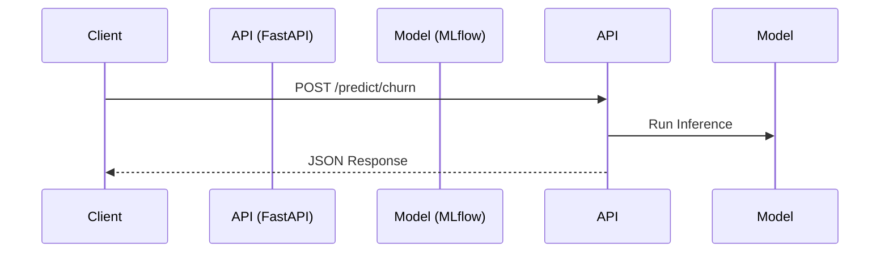

# API & Model Serving (FastAPI)

The FastAPI module handles real-time machine learning inference. It provides a secure, monitored, and high-performance gateway between the ML models and client applications.

## Inference Architecture



## Key Concepts

### 1. Robust Middleware Stack
The API implements production-grade middleware to protect the inference endpoints:
* **Authentication**: Requires an HMAC `X-API-Key` header on all protected routes.
* **Rate Limiting**: Utilizes a Redis-backed sliding window algorithm to cap users at 100 requests per minute per IP address.
* **Payload Compression**: Uses GZip middleware for responses exceeding 1KB.

### 2. Multi-Tier Fallback System
Machine learning APIs must be resilient to model crashes. If the serialized model (`.joblib`) is corrupted, missing, or throws an inference error, the API seamlessly falls back to a **Heuristic Rules Engine**. This ensures the API always returns a valid payload to the client, while tagging the response with a `fallback: true` flag.

### 3. Prediction Monitoring
Observability is critical in MLOps. Every prediction made by the API—whether successful or utilizing a fallback—is asynchronously logged to the `fact_prediction_monitoring` table in PostgreSQL. This captures the model confidence, latency (ms), and exact feature inputs, allowing Power BI to monitor for model drift and system health.

## Configuration & Usage

```bash
# Start the API locally via Uvicorn
uvicorn api.main:app --host 0.0.0.0 --port 8000 --reload

# Test an endpoint (API key set in .env as API_KEY)
curl -X POST http://localhost:8000/predict/churn \
     -H "Content-Type: application/json" \
     -H "X-API-Key: $API_KEY" \
     -d '{"tenure": 12, "monthly_charges": 50.0, "total_charges": 600.0, "contract_type": "Month-to-month", "payment_method": "Electronic check", "internet_service": "Fiber optic"}'
```
