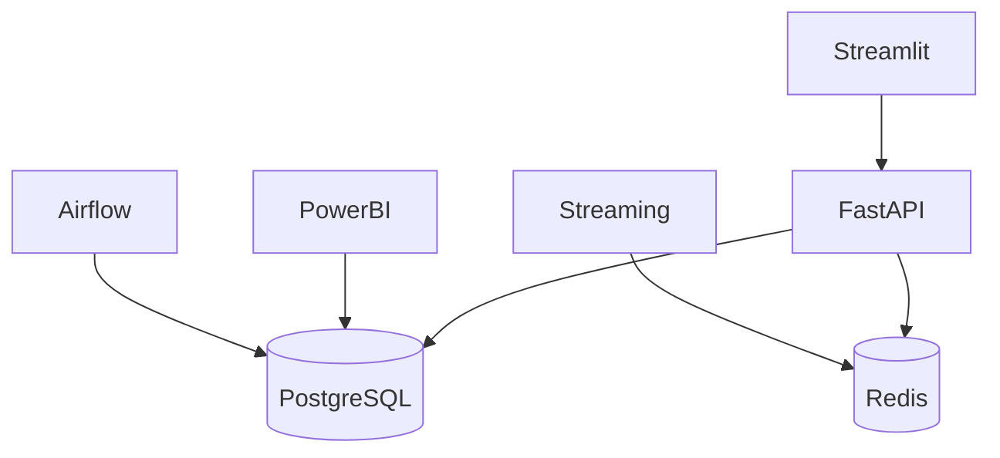

# Infrastructure & Deployment (Docker)

The FinSight platform is fully containerized using Docker and Docker Compose. This ensures environment consistency across development, testing, and production, while isolating the 10 disparate microservices.

## Microservices Architecture



## Key Concepts

### 1. Multi-Container Orchestration
The project uses `docker-compose.yml` for the base infrastructure and `docker-compose.local.yml` for local overrides (like exposing ports to the host machine). The stack includes:
* **PostgreSQL**: The central Data Warehouse.
* **Redis**: Acts as the rate-limiting cache, API session store, and real-time message broker (Redis Streams).
* **Airflow**: Runs via standard `apache/airflow` images, initializing the database automatically.
* **Custom Images**: FastAPI, Streamlit, and MLflow use custom `Dockerfile.*` definitions to install their specific Python requirements.

### 2. Network & Volume Isolation
All containers are connected via a custom bridge network (`finsight-network`), allowing them to communicate using DNS hostnames (e.g., FastAPI connects to the database using the hostname `postgres` rather than `localhost`).
Volumes are mounted for PostgreSQL data, Redis data, and MLflow artifacts to ensure persistence across container restarts.

## Configuration & Usage

The easiest way to stand up the entire infrastructure is using the provided bootstrap script:

```bash
# Windows PowerShell
.\scripts\bootstrap.ps1
```

Or manually using Docker Compose:

```bash
# Start infrastructure in detached mode
docker compose -f docker/docker-compose.yml -f docker/docker-compose.local.yml up -d

# View logs for a specific service (e.g., fastapi)
docker compose -f docker/docker-compose.yml -f docker/docker-compose.local.yml logs -f fastapi
```
