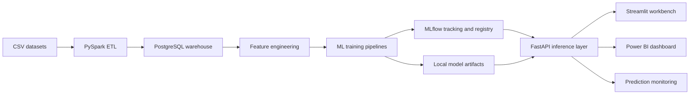

# FinSight ML Platform

FinSight is now structured as an end-to-end financial analytics and machine learning platform:



## Models

| Task | Target | Algorithms | Metrics |
|---|---|---|---|
| Customer churn | `churn_flag` | Logistic Regression, Random Forest, XGBoost, LightGBM | Accuracy, Precision, Recall, F1, ROC-AUC |
| Loan default | `default_flag` | XGBoost, CatBoost, Random Forest | Precision, Recall, F1, ROC-AUC |
| Fraud detection | `is_fraud` | Isolation Forest, XGBoost, LightGBM | Precision, Recall, F1, ROC-AUC |

## Feature Engineering

Churn:
- `tenure`
- `monthly_charges`
- `total_charges`
- `contract_type`
- `payment_method`
- `internet_service`

Loans:
- `fico_score`
- `debt_ratio`
- `loan_amount`
- `grade`
- `purpose`

Fraud:
- `transaction_amt`
- `device_type`
- `card_type`
- `browser`
- `email_domain`

## Training

Run all models:

```bash
python -m models.train_all --task all --max-rows 150000
```

Run one model:

```bash
python -m models.train_all --task churn
python -m models.train_all --task default
python -m models.train_all --task fraud
```

Log to MLflow:

```bash
python -m models.train_all --task all --log-mlflow
```

Artifacts are written to:

```text
models/artifacts/
  churn/model.joblib
  default/model.joblib
  fraud/model.joblib
```

## Explainability

Generate SHAP artifacts:

```bash
python -m models.explain --task churn
python -m models.explain --task default
python -m models.explain --task fraud
```

Expected artifacts:

- `summary_plot.png`
- `waterfall_plot.png`
- `dependence_plot.png`
- `feature_importance.csv`

## API

Endpoints:

- `POST /predict/churn`
- `POST /predict/default`
- `POST /predict/fraud`
- `GET /health`
- `POST /health`
- `POST /metrics`

Example:

```json
{
  "tenure": 12,
  "monthly_charges": 100,
  "total_charges": 1200,
  "contract_type": "Month-to-month",
  "payment_method": "Electronic check",
  "internet_service": "Fiber optic"
}
```

Response:

```json
{
  "prediction": "Will Churn",
  "probability": 0.93,
  "model": "finsight_churn",
  "model_version": "1.0.0",
  "top_drivers": ["contract_type", "monthly_charges", "tenure"],
  "inference_ms": 12,
  "fallback": false
}
```

## MLOps

Implemented:

- MLflow experiment tracking
- Model metadata
- Local artifact registry
- Optional MLflow model registration
- Metrics logging
- Parameters logging
- SHAP explainability artifacts
- Prediction monitoring SQL view

## Class Imbalance Strategy

Fraud and default datasets are imbalanced. The platform supports:

- Class-weighted estimators.
- XGBoost `scale_pos_weight`.
- Threshold tuning using F1 score.
- Optional SMOTE/undersampling extension through `imbalanced-learn`.

## Success Criteria

Target benchmark goals:

- Churn ROC-AUC greater than 0.85
- Default ROC-AUC greater than 0.85
- Fraud ROC-AUC greater than 0.90

Actual metrics are written to:

```text
models/artifacts/churn_benchmarks.csv
models/artifacts/default_benchmarks.csv
models/artifacts/fraud_benchmarks.csv
```
