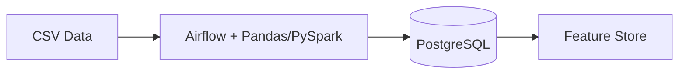
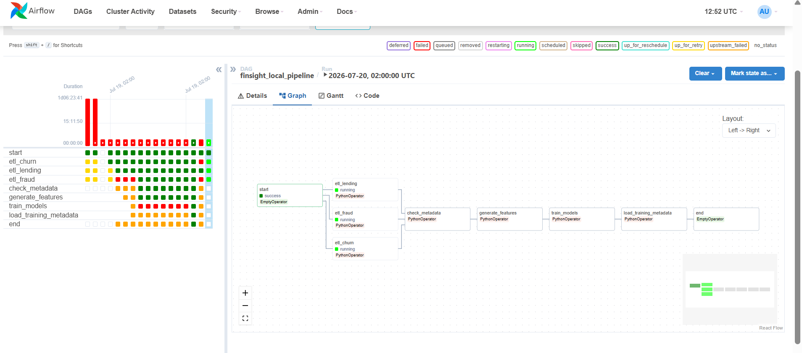
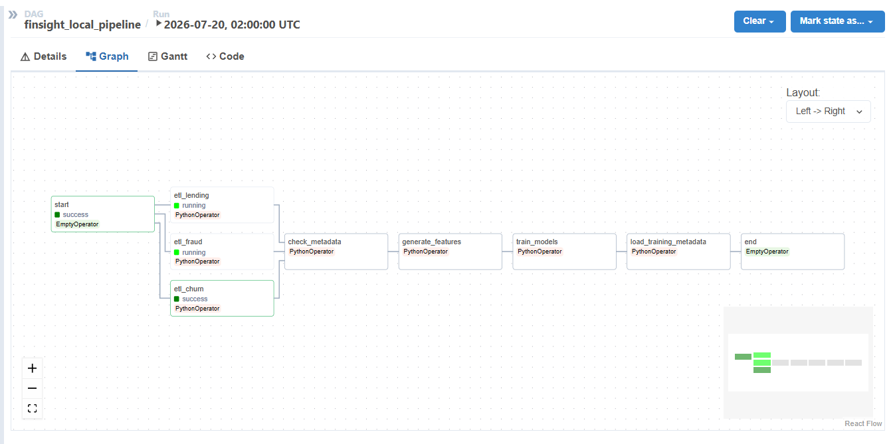
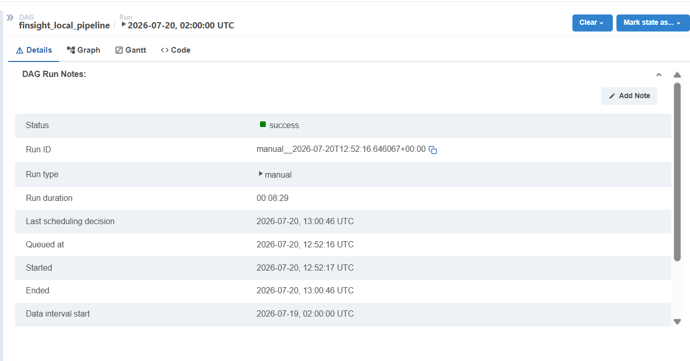
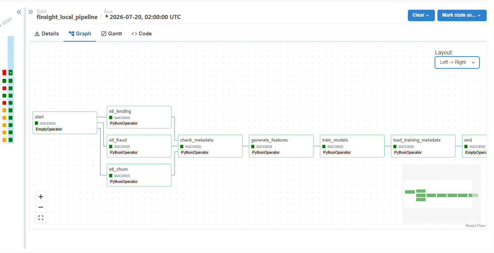
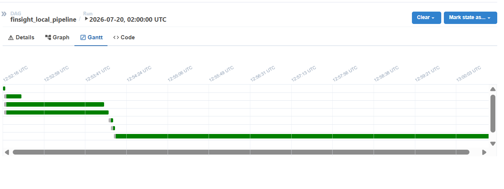

# Data Engineering and Orchestration

This module handles the ETL pipeline for FinSight: reading raw CSV files, cleaning and transforming the data, loading it into PostgreSQL, and computing a feature store for ML training. Apache Airflow orchestrates the whole thing.

## Architecture



## Data Sources

Three public datasets are used:

| Dataset | Source | Size | Prediction Target |
|---|---|---|---|
| IBM Telco Customer Churn | Kaggle | ~7K rows | Binary churn flag |
| Lending Club Loan Data | Kaggle | 2.26M rows, sampled to 50K | Binary default flag |
| IEEE-CIS Fraud Detection | Kaggle | 590K rows, sampled to 50K | Binary fraud flag |

## ETL Implementation

There are two implementations of the ETL logic:

**`run_local_etl.py` (Pandas)** is used for local development. It down-samples large datasets so the full pipeline can complete in a few minutes on a laptop:

```python
sample = 50000 if source in ("lending", "fraud") else None
rows = fn(engine, sample=sample)
```

Key transformations per source:
- Churn: converts `TotalCharges` to float, binarizes the `Churn` column (Yes/No to 1/0), bins tenure into groups
- Lending: parses interest rate strings, maps loan statuses to a binary default flag, drops columns with more than 40% nulls
- Fraud: merges `train_transaction.csv` and `train_identity.csv` on `TransactionID`, normalizes device and email fields, caps transaction amount outliers

**`pyspark_pipeline.py` (PySpark)** is written for large-scale environments. It uses the PySpark DataFrame API with a JDBC writer, so data streams directly into PostgreSQL without being pulled into local memory.

## Airflow Orchestration

The DAG `finsight_local_pipeline` runs daily at 2:00 AM. Here is how it is defined:

```python
dag = DAG(
    dag_id="finsight_local_pipeline",
    schedule_interval="0 2 * * *",
    start_date=datetime(2026, 1, 1),
    catchup=False,
    default_args={
        "owner": "data-engineering",
        "retries": 0,
        "execution_timeout": timedelta(hours=1),
    },
    tags=["finsight", "etl", "local"],
)
```

### Task Flow

```
start
 ├── etl_churn    ─┐
 ├── etl_lending  ─┼── (parallel) --> check_metadata --> generate_features --> train_models --> load_training_metadata --> end
 └── etl_fraud    ─┘
```

The three ETL tasks run in parallel. Airflow only moves forward once all three succeed. Here is the dependency definition:

```python
start >> [etl_churn, etl_lending, etl_fraud] >> check_metadata >> generate_features >> train_models >> load_training_metadata >> end
```

### What Each Task Does

| Task | Operator | Description |
|---|---|---|
| `start` | EmptyOperator | Entry point |
| `etl_churn` | PythonOperator | Reads Telco CSV, cleans and loads into `fact_churn` |
| `etl_lending` | PythonOperator | Reads Lending Club CSV (50K rows), loads into `fact_loan` |
| `etl_fraud` | PythonOperator | Merges transaction and identity CSVs, loads into `fact_transaction` |
| `check_metadata` | PythonOperator | Queries `etl_metadata` to confirm all three tasks logged a row |
| `generate_features` | PythonOperator | Aggregates all three fact tables and writes the `feature_store` |
| `train_models` | PythonOperator | Trains ML models for all three tasks, saves `model.joblib` |
| `load_training_metadata` | PythonOperator | Reads the `metadata.json` artifacts and inserts them into `fact_model_training` |
| `end` | EmptyOperator | Exit point |

The `train_models` task calls the same training functions used when running training locally:

```python
def train_models():
    from models.train_all import train_churn, train_default, train_fraud

    for task, runner in [("churn", train_churn), ("default", train_default), ("fraud", train_fraud)]:
        result = runner(data_dir, max_rows=150000)
        best = result["best"]
        logger.info(f"{task}: {best['algorithm']} ROC-AUC={best['metrics']['roc_auc']}")
```

After training, `load_training_metadata` reads each `metadata.json` file and inserts a row into `fact_model_training`. This table is what Power BI reads for the ML Monitoring page.

```python
for path in artifacts_dir.glob("*_metadata.json"):
    with open(path) as f:
        m = json.load(f)
    conn.execute(INSERT INTO fact_model_training ..., {
        "accuracy": m["metrics"]["accuracy"],
        "roc_auc":  m["metrics"]["roc_auc"],
        "threshold": m["threshold"],
    })
```

A few other things worth knowing about how Airflow is configured here:

- Each task returns its row count, which Airflow stores as an XCom. This lets downstream tasks verify that upstream work produced non-zero output.
- Every task has a 1-hour `execution_timeout`. If ETL stalls because of a dropped DB connection or a stuck job, Airflow marks the task as failed and stops the DAG instead of hanging indefinitely.

### Screenshots



*The Grid View shows the run history for each task. Green = success, red = failed, orange = running.*



*The DAG graph shows the three parallel ETL tasks fanning out from `start`, then converging into the sequential downstream steps.*



*Run details for a specific execution: status success, duration 8 minutes 29 seconds, triggered manually.*



*All tasks green on a successful run, including the parallel ETL fan-out.*



*The Gantt view shows the three parallel ETL tasks overlapping, then the sequential tasks running one after another.*

## Feature Store

After ETL completes, `generate_features` aggregates across all three fact tables to produce one composite risk score per customer:

```sql
SELECT
    customer_id,
    AVG(churn_rate)   AS churn_rate,
    AVG(default_rate) AS default_rate,
    AVG(fraud_rate)   AS fraud_rate,
    0.40 * AVG(fraud_rate) + 0.30 * AVG(default_rate) + 0.30 * AVG(churn_rate) AS composite_risk_score
FROM (fact_churn JOIN fact_loan JOIN fact_transaction)
GROUP BY customer_id
```

The formula: `composite_risk_score = 0.40 * fraud_rate + 0.30 * default_rate + 0.30 * churn_rate`

The feature store is the single source of truth for both ML training and API inference, which keeps training and serving consistent.

## Usage

```bash
# Run ETL locally without Airflow
python etl/scripts/run_local_etl.py --source churn
python etl/scripts/run_local_etl.py --source lending --sample 50000
python etl/scripts/run_local_etl.py --source fraud   --sample 50000
python etl/scripts/feature_store.py

# Start Airflow via Docker
docker compose -f docker/docker-compose.yml -f docker/docker-compose.local.yml up \
    airflow-init airflow-scheduler airflow-webserver
```
