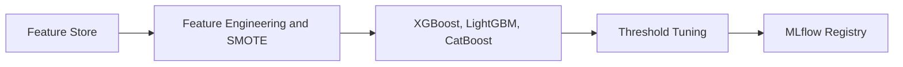
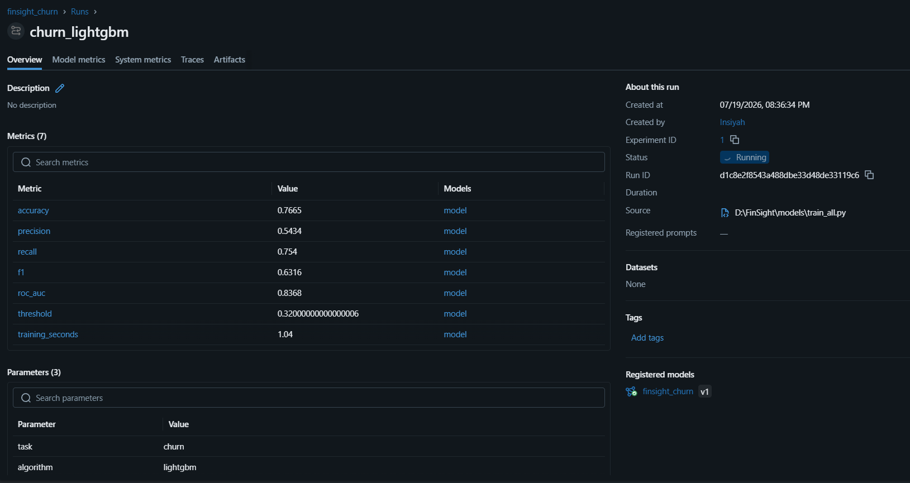
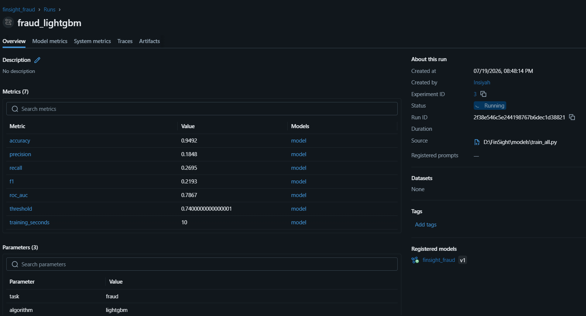
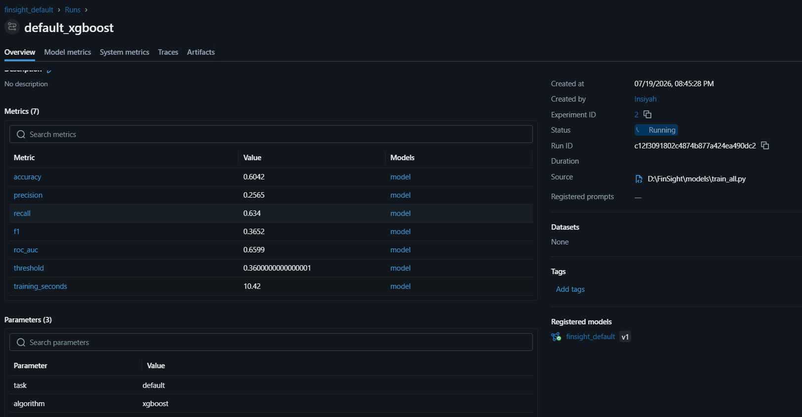

# Machine Learning Pipeline

FinSight trains three models: one for customer churn, one for loan default, and one for fraud detection. The training pipeline is the same for all three tasks: load data from the feature store, preprocess it, train several algorithms, pick the best one by ROC-AUC, tune the decision threshold, and save the artifacts.

## Training Architecture



## Prediction Tasks

| Task | Dataset | Winning Algorithm | ROC-AUC (CV) | Threshold |
|---|---|---|---|---|
| Customer Churn | IBM Telco | Logistic Regression | 0.839 (0.844) | 0.32 |
| Fraud Detection | IEEE-CIS | XGBoost | 0.857 (0.904) | 0.72 |
| Loan Default | Lending Club | CatBoost | 0.701 (0.699) | 0.52 |

Latest results (v2 pipeline: 5-fold CV tournament, winner tuning; fraud trained on all 590k rows):

| Model Task | Old ROC-AUC | New ROC-AUC | Train/Test gap | Verdict |
| :--- | :--- | :--- | :--- | :--- |
| **Loan Default** | ~0.66 | **0.701** | +0.008 | No overfitting |
| **Fraud Detection** | ~0.79 | **0.857** (causal split, full 590k rows) | +0.057 | No — gap is drift |
| **Customer Churn** | ~0.84 | **0.839** | +0.007 | No overfitting |

Fraud note: trained on **all 590,540 IEEE-CIS rows** (472k train / 118k test, chronological split so the test set is the most recent 20% of the stream). Training-side velocity is recomputed with a boundary cutoff (`velocity_cutoff_dt`) so training features can never incorporate future transactions. The winning XGBoost is tuned with regularization (`min_child_weight`, `gamma`, `reg_lambda`, `n_estimators` capped at 300). **train AUC 0.914 ≈ CV 0.904 — the model is not overfitting.** The ~+0.057 train/test gap is temporal drift: the test period is the future, and fraud patterns shift over the 9-month stream. Training on 4x more data (150k -> 590k rows) raised CV from 0.895 to 0.904 while the test number reads slightly lower (0.868 -> 0.857) only because the chronological test window is now the later, harder 118k rows, not a regression in model quality.

## Overfitting Reduction

One-line summary per model (full details in the notes above):

- **Churn** — winner chosen by a 5-fold stratified CV tournament with hyperparameter tuning; train ≈ CV ≈ test (gap +0.007), so no overfitting.
- **Loan default** — 5-fold CV tournament plus calibrated SMOTE/undersampling and winner tuning; train ≈ CV ≈ test (gap +0.008), so no overfitting.
- **Fraud** — reduced overfitting with a causal chronological split (`velocity_cutoff_dt`), regularized XGBoost (`min_child_weight`, `gamma`, `reg_lambda`, `n_estimators` ≤ 300), and full 590k-row training; the remaining test gap (+0.057) is temporal drift, not overfit (train 0.914 ≈ CV 0.904).

## Feature Engineering

Each task has a `FeatureSpec` dataclass that defines which columns are numeric, which are categorical, and what the target is:

```python
CHURN_SPEC = FeatureSpec(
    numeric_features=["tenure", "monthly_charges", "total_charges"],
    categorical_features=["contract_type", "payment_method", "internet_service",
                          "online_security", "tech_support", "paperless_billing", "streaming_tv"],
    target="churn_flag",
)

DEFAULT_SPEC = FeatureSpec(
    numeric_features=["fico_score", "debt_ratio", "loan_amount", "annual_inc", "emp_length",
                      "revol_bal", "revol_util", "delinq_2yrs", "pub_rec", "open_acc"],
    categorical_features=["grade", "purpose", "home_ownership", "verification_status"],
    target="default_flag",
)

FRAUD_SPEC = FeatureSpec(
    numeric_features=["transaction_amt", "dist1", "dist2",
                      "txn_cnt_1h", "txn_cnt_24h", "txn_amt_sum_24h", "txn_amt_std_24h",
                      *FRAUD_C_FEATURES, *FRAUD_V_FEATURES],  # C1-C14 + 30 curated V features
    categorical_features=["device_type", "card_type", "browser", "email_domain"],
    target="is_fraud",
)
```

A scikit-learn preprocessing pipeline is built from this spec automatically:
- Numeric columns: `SimpleImputer(median)` then `StandardScaler`
- Categorical columns: `SimpleImputer(most_frequent)` then `OneHotEncoder(handle_unknown='ignore')`

### Fraud velocity features

`normalize_fraud()` computes rolling velocity aggregates per card (`card1`) directly from the
IEEE-CIS `TransactionDT` stream (seconds): transaction counts over 1h/24h trailing windows and
24h amount sum / standard deviation. Rows without a usable timestamp or entity key get `NaN` and
fall through to the imputer.

Velocity is a time-series feature: each row only aggregates transactions at or before its own
timestamp. To keep evaluation causal, the fraud task is **split chronologically** in
`train_candidates` (test = most recent 20% of the stream, via the `time_col` argument wired in
`train_fraud`), falling back to a stratified random split if either side lacks a class.

## Handling Class Imbalance (SMOTE)

Fraud data is about 3% positive, which makes naive classifiers just predict "not fraud" and get 97% accuracy. To fix this, the fraud and default pipelines use calibrated resampling:

```python
ImbPipeline([
    ("preprocessor", build_preprocessor(spec)),
    ("smote", SMOTE(sampling_strategy=0.25, random_state=42)),       # minority -> 25% of majority
    ("under", RandomUnderSampler(sampling_strategy=0.50, random_state=42)),  # -> 1:2 minority:majority
    ("model", estimator),
])
```

Fixed ratios avoid the excessive synthetic noise that the default 1:1 resampling produces on very
sparse classes. In addition, `candidate_models()` applies dynamic class weighting:
`scale_pos_weight = count(neg) / count(pos)` for fraud XGBoost, `class_weight="balanced"` for
LightGBM, and `auto_class_weights="Balanced"` for CatBoost.

## Candidate Model Tournament

Multiple algorithms compete in a **stratified 5-fold cross-validation tournament**: each candidate is
scored on out-of-fold (OOF) predictions (`cv_roc_auc`) rather than a single 80/20 split, then refit on
the full training set for final evaluation. The winner is selected by OOF ROC-AUC.

For churn, four candidates compete:

```python
candidates = {
    "logistic_regression": LogisticRegression(max_iter=1000, class_weight="balanced"),
    "random_forest":       RandomForestClassifier(n_estimators=180, class_weight="balanced"),
    "xgboost":             XGBClassifier(eval_metric="logloss"),
    "lightgbm":            LGBMClassifier(),
}
```

For fraud, an unsupervised isolation forest is also tested as a baseline:

```python
candidates = {
    "isolation_forest": IsolationForest(contamination=0.04),
    "xgboost":          XGBClassifier(scale_pos_weight=10),
    "lightgbm":         LGBMClassifier(class_weight="balanced"),
}
```

## Threshold Tuning

The pipeline does not use the default 0.5 cutoff. Churn and default maximize F1 over a coarse grid,
but fraud uses a **cost-aware objective** that treats a missed fraud (FN) as much more expensive than
a false alert (FP):

```python
def tune_threshold(y_true, y_score, cost_fn=500.0, cost_fp=15.0) -> float:
    precisions, recalls, thresholds = precision_recall_curve(y_true, y_score)
    total_positives = np.sum(y_true)
    total_negatives = len(y_true) - total_positives
    tp = recalls * total_positives
    fn = total_positives - tp
    fp = np.where(precisions > 0, (tp / precisions) - tp, 0)
    costs = (fn * cost_fn) + (fp * cost_fp)
    return float(thresholds[np.argmin(costs)])
```

## Hyperparameter Search on the Winner

After the tournament, a `RandomizedSearchCV` run (3-fold, up to 6 iterations) searches the winning
architecture's hyperparameter grid (e.g. XGBoost `max_depth`, `learning_rate`, `subsample`,
`colsample_bytree`) before the model is serialized. Skip it with `--no-tune`.

Actual results (v2):
- Churn Logistic Regression: threshold 0.32
- Fraud XGBoost: threshold 0.72 (cost-aware: FN=$500 vs FP=$15)
- Default CatBoost: threshold 0.52

## Artifacts

The winning model per task is saved as two files:

```python
joblib.dump(best_pipeline, "models/artifacts/churn/model.joblib")
json.dump(metadata, open("models/artifacts/churn/metadata.json"))
```

`metadata.json` contains everything needed to understand and serve the model:

```json
{
    "name": "finsight_churn",
    "algorithm": "lightgbm",
    "version": "1.0.0",
    "threshold": 0.32,
    "metrics": { "accuracy": 0.77, "roc_auc": 0.84, "f1": 0.63 },
    "features": ["tenure", "monthly_charges", "..."],
    "target": "churn"
}
```

A `feature_importance.csv` is also written from the model's `feature_importances_` attribute.

## MLflow Tracking

Every training run is logged to MLflow under a separate experiment per task (`finsight_churn`, `finsight_fraud`, `finsight_default`).

```python
def log_to_mlflow(task: str, model_path: Path, metadata: dict):
    mlflow.set_tracking_uri("http://localhost:5000")
    mlflow.set_experiment(f"finsight_{task}")

    with mlflow.start_run(run_name=f"{task}_{metadata['algorithm']}"):
        mlflow.log_params({
            "task":      task,
            "algorithm": metadata["algorithm"],
            "target":    metadata["target"],
        })
        mlflow.log_metrics(metadata["metrics"])
        mlflow.log_dict(metadata, "metadata.json")
        mlflow.sklearn.log_model(
            model,
            artifact_path="model",
            registered_model_name=f"finsight_{task}",
        )
```

What gets stored per run:

| Type | Key | Example |
|---|---|---|
| Param | `task` | `churn` |
| Param | `algorithm` | `lightgbm` |
| Metric | `accuracy` | `0.7665` |
| Metric | `roc_auc` | `0.8368` |
| Metric | `f1` | `0.6316` |
| Metric | `threshold` | `0.32` |
| Metric | `training_seconds` | `1.04` |
| Artifact | `metadata.json` | Full config |
| Artifact | `model/` | Serialized sklearn pipeline |
| Registry | `finsight_churn v1` | Auto-registered |

### Screenshots



*Churn LightGBM run in the `finsight_churn` experiment. All 7 metrics logged, accuracy 0.77, ROC-AUC 0.84, training time 1.04 seconds. The model was auto-registered as `finsight_churn v1`.*



*Fraud LightGBM run in the `finsight_fraud` experiment. High accuracy (0.95) but low precision (0.18) and recall (0.27) shows the class imbalance challenge. Threshold tuned to 0.74.*



*Default XGBoost run in the `finsight_default` experiment. Parameters (task=default, algorithm=xgboost) visible in the Parameters section.*

## Model Loading in FastAPI

The API loads models from the local artifact directory and caches them in Redis:

```python
class ModelRegistry:
    def load(self, task: str) -> LocalModel:
        cached = redis.get(f"model:{task}")
        if cached:
            return pickle.loads(cached)

        model = joblib.load(f"models/artifacts/{task}/model.joblib")
        redis.setex(f"model:{task}", 3600, pickle.dumps(model))
        return model
```

First request takes about 200ms to load from disk. Subsequent requests hit the Redis cache and return in around 5ms.

## Usage

```bash
# Train all three models
python -m models.train_all --task all --max-rows 150000 --log-mlflow

# Train one task only
python -m models.train_all --task churn --max-rows 50000 --log-mlflow

# Skip the winner hyperparameter search for faster iteration
python -m models.train_all --task default --cv-folds 3 --no-tune

# Open MLflow UI
mlflow ui --port 5000
# http://localhost:5000

# Artifacts are written to:
models/artifacts/
├── churn/
│   ├── model.joblib
│   ├── metadata.json
│   └── feature_importance.csv
├── fraud/
└── default/
```
