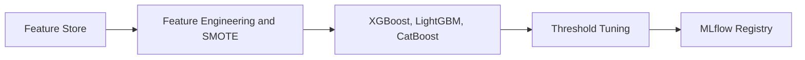

# Machine Learning Pipeline

FinSight trains three models: one for customer churn, one for loan default, and one for fraud detection. The training pipeline is the same for all three tasks: load data from the feature store, preprocess it, train several algorithms, pick the best one by ROC-AUC, tune the decision threshold, and save the artifacts.

## Training Architecture



## Prediction Tasks

| Task | Dataset | Winning Algorithm | ROC-AUC |
|---|---|---|---|
| Customer Churn | IBM Telco | LightGBM | ~0.84 |
| Fraud Detection | IEEE-CIS | LightGBM | ~0.79 |
| Loan Default | Lending Club | XGBoost | ~0.66 |

The loan default ROC-AUC of ~0.66 is expected with this dataset. The Lending Club data is missing features that matter in real underwriting (verified income, employment history, bank statements). With a complete feature set the number would be significantly higher.

## Feature Engineering

Each task has a `FeatureSpec` dataclass that defines which columns are numeric, which are categorical, and what the target is:

```python
CHURN_SPEC = FeatureSpec(
    numeric_features=["tenure", "monthly_charges", "total_charges"],
    categorical_features=["contract_type", "payment_method", "internet_service"],
    target="churn",
)

FRAUD_SPEC = FeatureSpec(
    numeric_features=["transaction_amt", "dist1", "dist2", ...],
    categorical_features=["device_type", "card4", "email_domain"],
    target="is_fraud",
)
```

A scikit-learn preprocessing pipeline is built from this spec automatically:
- Numeric columns: `SimpleImputer(median)` then `StandardScaler`
- Categorical columns: `SimpleImputer(most_frequent)` then `OneHotEncoder(handle_unknown='ignore')`

## Handling Class Imbalance (SMOTE)

Fraud data is about 3% positive, which makes naive classifiers just predict "not fraud" and get 97% accuracy. To fix this, the fraud and default pipelines use SMOTE combined with random undersampling:

```python
ImbPipeline([
    ("preprocessor", build_preprocessor(spec)),
    ("smote", SMOTE(random_state=42)),
    ("under", RandomUnderSampler(random_state=42)),
    ("model", estimator),
])
```

This synthetically oversamples the minority class, then trims the majority class to bring the distribution to a reasonable balance before training.

## Candidate Model Tournament

Multiple algorithms are trained and the one with the highest ROC-AUC on the test set wins. The split is 80% train, 20% test.

For churn, four candidates compete:

```python
candidates = {
    "logistic_regression": LogisticRegression(max_iter=1000, class_weight="balanced"),
    "random_forest":       RandomForestClassifier(n_estimators=180, class_weight="balanced"),
    "xgboost":             XGBClassifier(eval_metric="logloss"),
    "lightgbm":            LGBMClassifier(),
}
```

For fraud, an unsupervised isolation forest is also tested as a baseline:

```python
candidates = {
    "isolation_forest": IsolationForest(contamination=0.04),
    "xgboost":          XGBClassifier(scale_pos_weight=10),
    "lightgbm":         LGBMClassifier(class_weight="balanced"),
}
```

## Threshold Tuning

The pipeline does not use the default 0.5 cutoff. Instead it searches 40 thresholds between 0.1 and 0.9 and picks whichever maximizes F1:

```python
def tune_threshold(y_true, y_score) -> float:
    thresholds = np.arange(0.1, 0.91, step=0.02)
    scores = [(thr, f1_score(y_true, y_score >= thr)) for thr in thresholds]
    return max(scores, key=lambda x: x[1])[0]
```

Actual results:
- Churn LightGBM: threshold 0.32 (lower to catch more churners)
- Fraud LightGBM: threshold 0.74 (higher to reduce false alarms)
- Default XGBoost: threshold 0.36

## Artifacts

The winning model per task is saved as two files:

```python
joblib.dump(best_pipeline, "models/artifacts/churn/model.joblib")
json.dump(metadata, open("models/artifacts/churn/metadata.json"))
```

`metadata.json` contains everything needed to understand and serve the model:

```json
{
    "name": "finsight_churn",
    "algorithm": "lightgbm",
    "version": "1.0.0",
    "threshold": 0.32,
    "metrics": { "accuracy": 0.77, "roc_auc": 0.84, "f1": 0.63 },
    "features": ["tenure", "monthly_charges", "..."],
    "target": "churn"
}
```

A `feature_importance.csv` is also written from the model's `feature_importances_` attribute.

## MLflow Tracking

Every training run is logged to MLflow under a separate experiment per task (`finsight_churn`, `finsight_fraud`, `finsight_default`).

```python
def log_to_mlflow(task: str, model_path: Path, metadata: dict):
    mlflow.set_tracking_uri("http://localhost:5000")
    mlflow.set_experiment(f"finsight_{task}")

    with mlflow.start_run(run_name=f"{task}_{metadata['algorithm']}"):
        mlflow.log_params({
            "task":      task,
            "algorithm": metadata["algorithm"],
            "target":    metadata["target"],
        })
        mlflow.log_metrics(metadata["metrics"])
        mlflow.log_dict(metadata, "metadata.json")
        mlflow.sklearn.log_model(
            model,
            artifact_path="model",
            registered_model_name=f"finsight_{task}",
        )
```

What gets stored per run:

| Type | Key | Example |
|---|---|---|
| Param | `task` | `churn` |
| Param | `algorithm` | `lightgbm` |
| Metric | `accuracy` | `0.7665` |
| Metric | `roc_auc` | `0.8368` |
| Metric | `f1` | `0.6316` |
| Metric | `threshold` | `0.32` |
| Metric | `training_seconds` | `1.04` |
| Artifact | `metadata.json` | Full config |
| Artifact | `model/` | Serialized sklearn pipeline |
| Registry | `finsight_churn v1` | Auto-registered |

### Screenshots


*Churn LightGBM run in the `finsight_churn` experiment. All 7 metrics logged, accuracy 0.77, ROC-AUC 0.84, training time 1.04 seconds. The model was auto-registered as `finsight_churn v1`.*


*Fraud LightGBM run in the `finsight_fraud` experiment. High accuracy (0.95) but low precision (0.18) and recall (0.27) shows the class imbalance challenge. Threshold tuned to 0.74.*


*Default XGBoost run in the `finsight_default` experiment. Parameters (task=default, algorithm=xgboost) visible in the Parameters section.*

## Model Loading in FastAPI

The API loads models from the local artifact directory and caches them in Redis:

```python
class ModelRegistry:
    def load(self, task: str) -> LocalModel:
        cached = redis.get(f"model:{task}")
        if cached:
            return pickle.loads(cached)

        model = joblib.load(f"models/artifacts/{task}/model.joblib")
        redis.setex(f"model:{task}", 3600, pickle.dumps(model))
        return model
```

First request takes about 200ms to load from disk. Subsequent requests hit the Redis cache and return in around 5ms.

## Usage

```bash
# Train all three models
python -m models.train_all --task all --max-rows 150000 --log-mlflow

# Train one task only
python -m models.train_all --task churn --max-rows 50000 --log-mlflow

# Open MLflow UI
mlflow ui --port 5000
# http://localhost:5000

# Artifacts are written to:
models/artifacts/
├── churn/
│   ├── model.joblib
│   ├── metadata.json
│   └── feature_importance.csv
├── fraud/
└── default/
```
