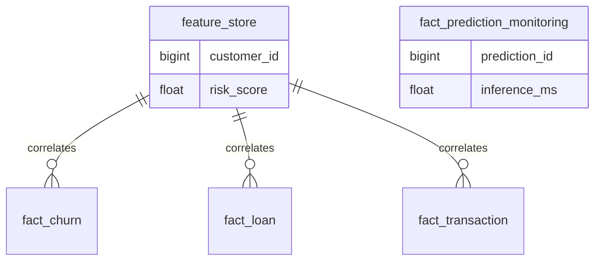

# Data Warehouse (SQL Schema)

The PostgreSQL Data Warehouse acts as the central source of truth for the FinSight platform. It stores analytical fact tables, the aggregated feature store, ML monitoring logs, and real-time streaming data.

## Entity-Relationship (ER) Architecture



## Key Concepts

### 1. Star Schema & Fact Tables
The schema is built around three distinct analytical fact tables (`01_schema.sql`). Each table tracks granular events specific to a financial domain:
* `fact_churn`: Telecommunications/Banking churn tracking.
* `fact_loan`: Lending origination and default tracking.
* `fact_transaction`: Credit card transaction monitoring for fraud.

### 2. Machine Learning Monitoring
`02_ml_monitoring.sql` sets up the `fact_prediction_monitoring` table. Every time the FastAPI application serves an inference, it logs the latency, confidence score, and whether it used a model or fell back to heuristics. This enables Power BI to track model drift and API health in near real-time.

### 3. Feature Store Tables
`03_feature_store.sql` creates the schema for the composite risk store. This table is overwritten daily by the Airflow DAG, ensuring the Power BI dashboards and the ML pipelines always query the freshest possible risk aggregations.

### 4. Streaming Tables
`05_streaming.sql` provides the infrastructure for high-velocity real-time data ingestion. A consumer script pulling from Redis writes to `fact_streaming_transaction`, while materialized views create fast, pre-computed windows for live dashboard rendering.

## Configuration & Usage

The schema is automatically initialized when the PostgreSQL Docker container starts (via init scripts). To apply changes manually:

```bash
# Execute scripts in sequence
psql -U finsight_user -d finsight -f sql/warehouse/01_schema.sql
psql -U finsight_user -d finsight -f sql/warehouse/02_ml_monitoring.sql
```
