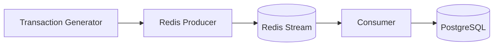

# Real-Time Streaming Architecture

The streaming module simulates and processes a high-velocity, real-time financial transaction feed. It utilizes Redis Streams as a lightweight message broker, demonstrating a classic producer-consumer pattern.

## Streaming Flow



## Key Concepts

### 1. Redis Streams Broker
We use Redis Streams instead of Apache Kafka to maintain a lightweight infrastructure footprint. The Producer uses the `XADD` command to push serialized JSON transactions into the stream. 

### 2. Consumer Groups
The Consumer script utilizes Redis Consumer Groups (`XREADGROUP`). This allows for horizontal scaling; multiple consumer instances can read from the same stream simultaneously without duplicating message processing. If a consumer crashes, pending messages can be claimed by another worker.

### 3. Real-Time Fraud Injection
The `generator.py` script continuously creates realistic financial transactions. It mathematically injects anomalies, enforcing a ~3% statistical fraud rate. This allows the Power BI Real-Time dashboard to demonstrate live anomaly detection and alert triggering.

## Configuration & Usage

The streaming pipeline requires a running Redis instance. The `bootstrap.ps1` script typically handles starting these in Docker, but they can be run manually:

```bash
# Start generating and producing messages to Redis
python streaming/producer.py

# In a separate terminal, consume messages from Redis and write to DB
python streaming/consumer.py
```
