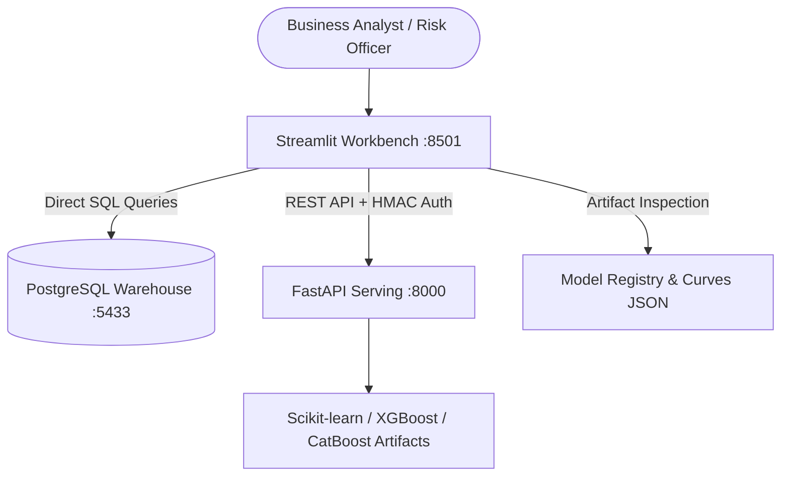

# Streamlit Analytics & ML Workbench

The Streamlit frontend provides an interactive executive and operational workbench for FinSight. It connects directly to the PostgreSQL warehouse (with fallback to synthetic benchmarks) and the FastAPI inference engine to deliver question-driven business analytics, model diagnostic monitoring, and real-time prediction scoring.

## Architecture



---

## 1. Executive & Business Intelligence Dashboards

Framed around key decision-making questions that leadership and risk committees ask across the banking lifecycle.

### Executive Overview
Answers: *Where is the business exposed across risk verticals, and where should we act first?*
- Cross-vertical KPI banner: Customer Churn Rate, Annual Revenue at Risk, Loan Default Rate, Capital in Default, Fraud Rate, Fraud Exposure, and ETL Pipeline Success.
- Prioritized action checklist highlighting specific high-risk cohorts (e.g. Month-to-month contracts, Grade C lending losses, anonymous email domain fraud).


### Churn & Customer Retention
Answers: *Who leaves, why it matters, and which accounts should retention teams prioritize?*
- Financial impact: Churn rate (32.2%), customer loss count, and lost annualized recurring revenue ($1.23M).
- Segment risk distribution: Contract length comparison (Month-to-month at 48% churn vs. One-year at 13.6% and Two-year at 12.7%).
- Target list: Accounts generating the highest recurring revenue combined with elevated churn probabilities.


### Lending Risk & Portfolio Default
Answers: *Where does the lending book lose money, and is credit priced adequately for the risk?*
- Portfolio health: Total active loans (20,000), default rate (11.9%), and defaulted principal balance ($43.57M).
- Credit grade segmentation: Default rates across FICO tiers and internal grades (A through G).
- Risk pricing validation: Comparison between interest rates charged and realized default loss across borrower cohorts.


### Transaction Fraud Analysis
Answers: *Where and when do fraud losses cluster, and can fraud operations handle the volume?*
- Operational KPIs: 30,000 transactions monitored, 4.0% fraud rate, and $156,021 net exposure.
- Channel and device vulnerability: Analysis of attack vectors by device type (desktop vs mobile), browser, card brand, and email domain.
- Hourly/temporal heatmaps: Transaction velocity and suspicious patterns across time windows.


### Data Health & ETL Pipeline Reliability
Answers: *Can business stakeholders trust the data feeding downstream models and reports?*
- Pipeline execution tracking: 60 Airflow DAG executions, 91.7% success rate, 12.5M records ingested, and failure volumes.
- Runtime trendline: Dual-axis tracking of average duration (minutes) vs. success percentage.
- Granular table health: Failure rates and error logs broken down by fact table (`fact_churn`, `fact_loan`, `fact_transaction`).


---

## 2. Machine Learning Operations & Model Diagnostics

### Model Performance
Displays validation-tuned metrics and candidate tournaments for all three deployed models.
- **Fair evaluation**: Thresholds and probability calibration are fit strictly on validation holdouts, ensuring unbiased test evaluation.
- **Rich metrics**: ROC-AUC, CV ROC-AUC, Precision, Recall, F1, KS-statistic, Lift @ Top 10%, and Brier calibration score.
- **Inspection tabs**: ROC/PR Curves, Confusion Matrix & Calibration curves, Feature Importance, Tournament Candidate Leaderboards, and Model Card metadata.


---

## 3. Real-Time Inference & Batch Scoring

### Customer Churn Predictor
Evaluates customer account parameters (tenure, charges, contract, add-on services) against the deployed Logistic Regression model. Returns risk classification, calibrated churn probability, probability gauge, decision threshold, and latency.


### Loan Default Predictor
Assesses borrower credit risk using FICO score, debt-to-income ratio, loan amount, grade, income, and utilization with the CatBoost model.


### Fraud Detection Predictor
Evaluates transaction amounts, card brand, device type, email domain, and transaction velocity context using regularized XGBoost.


### High-Throughput Batch Scoring
Upload CSV datasets to score up to 5,000 records simultaneously via the authenticated FastAPI endpoints. Features real-time scoring progress, success/error tracking, probability score distribution histogram, and downloadable scored CSV.


---

## How to Run

1. **Start the FastAPI backend**:
   ```bash
   python -m uvicorn api.main:app --host 127.0.0.1 --port 8000
   ```

2. **Launch Streamlit**:
   ```bash
   streamlit run streamlit/app.py
   ```

The app automatically reads `FINSIGHT_API_KEY` and `WAREHOUSE_URL` from `.env` or system environment variables.
