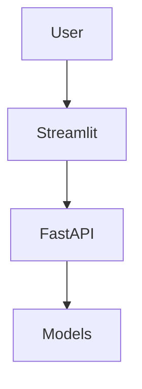
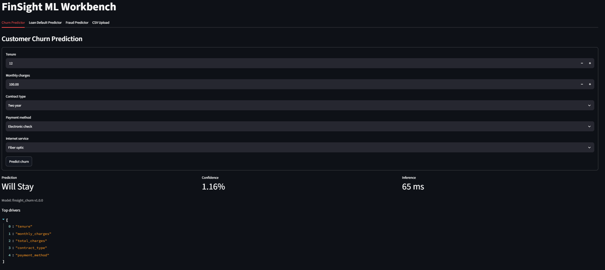
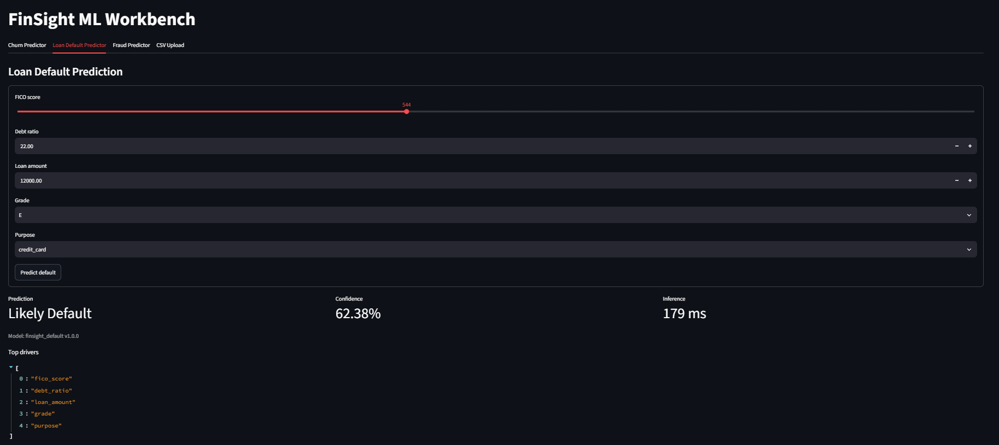
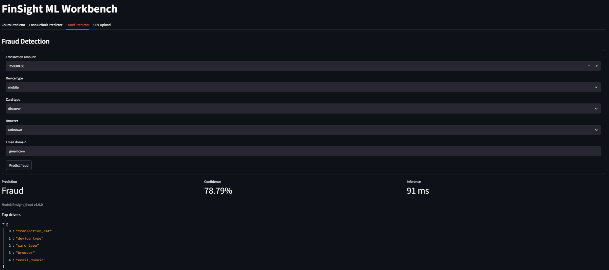

# Interactive ML Workbench

The Streamlit app is a frontend for testing the FastAPI inference endpoints. It lets you submit prediction requests through a form interface and see the result, confidence score, and top feature drivers without writing any code.

## Architecture



## Tabs

The app has four tabs:

1. **Churn Predictor** - Enter customer tenure, monthly charges, contract type, and internet service. The app calls `/predict/churn` and shows the prediction, confidence, and inference time.
2. **Loan Default Predictor** - Enter FICO score, debt ratio, loan amount, grade, and purpose. Calls `/predict/default`.
3. **Fraud Detection** - Enter transaction amount, device type, card type, browser, and email domain. Calls `/predict/fraud`.
4. **System Health** - Hits the `/health` and `/metrics` endpoints and shows which models are loaded versus falling back to heuristics.

## Screenshots



*Churn Predictor tab: predicts "Will Stay" with 1.16% confidence in 65ms.*



*Loan Default Predictor tab: predicts "Likely Default" at 62.38% confidence in 179ms.*



*Fraud Detection tab: flags a $250K mobile transaction as "Fraud" at 78.79% confidence in 91ms.*

## Usage

Make sure FastAPI is running on port 8000 before starting the Streamlit app:

```bash
streamlit run streamlit/app.py
```

The app reads `FINSIGHT_API_KEY` from the environment to authenticate requests to the API.
